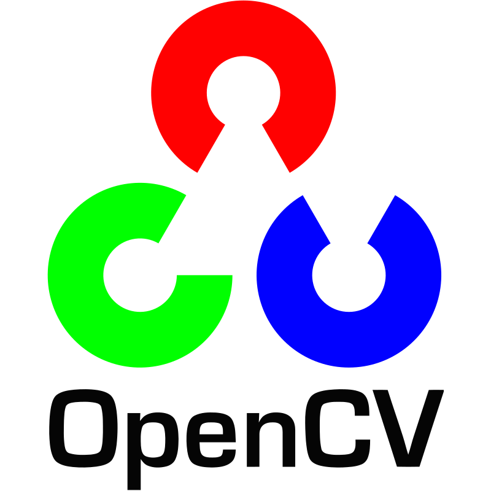
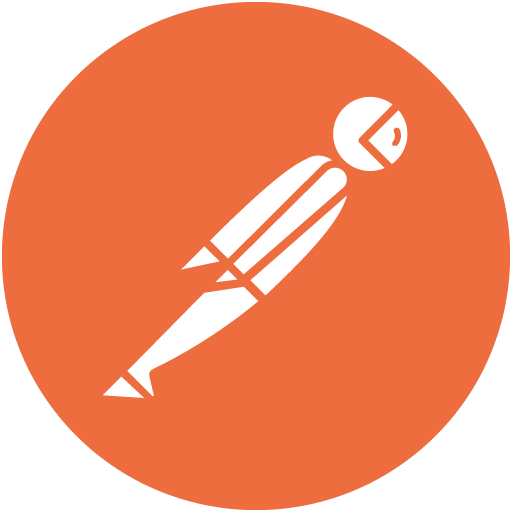
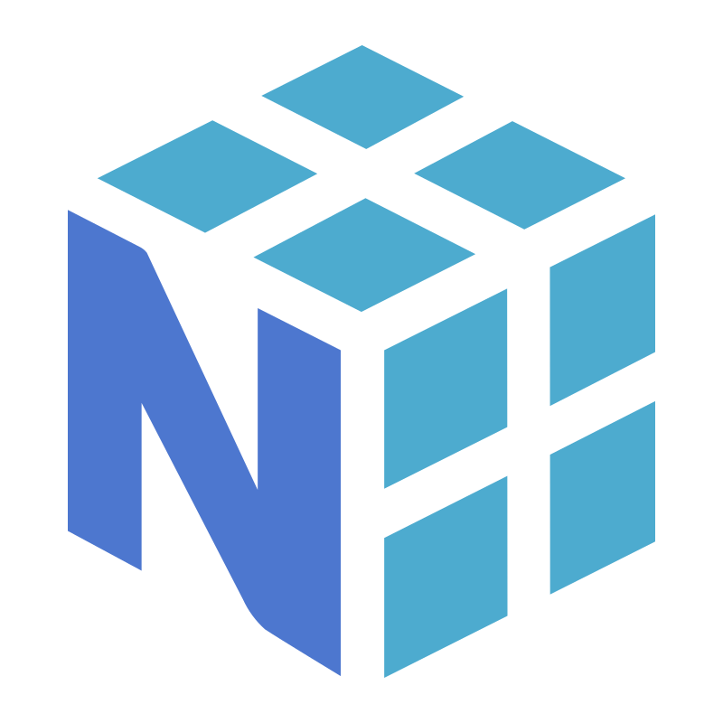
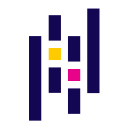
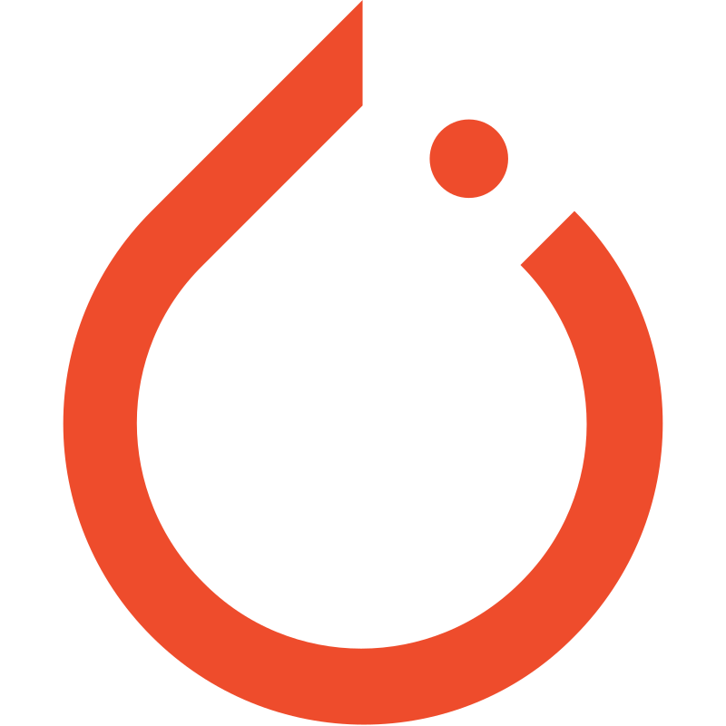
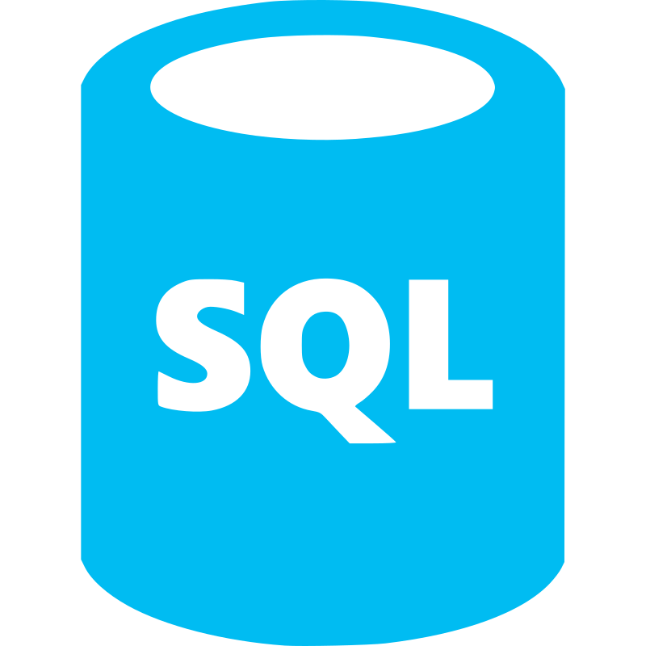
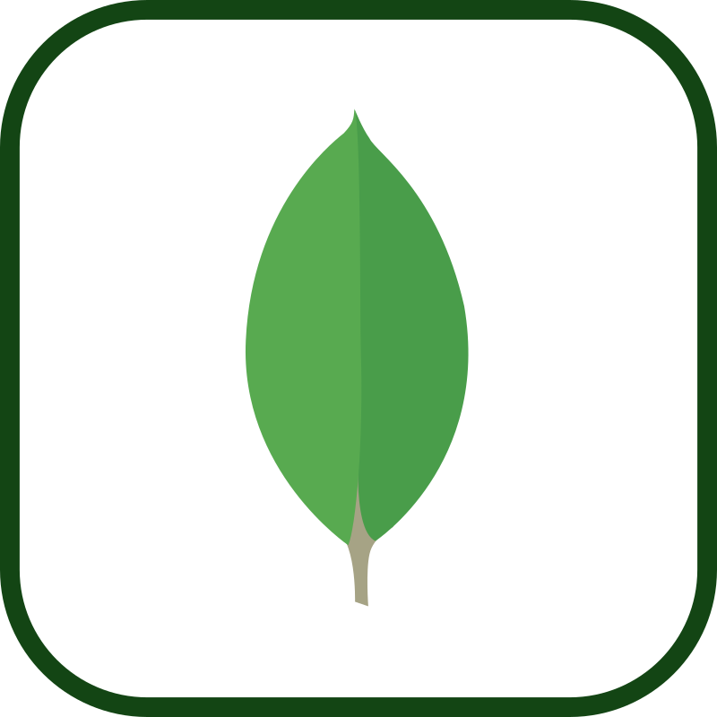
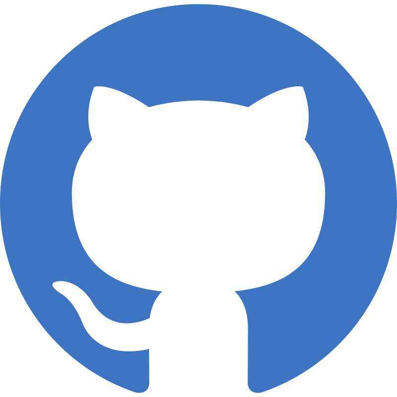

<table width="100%">
<tr>
<td align="left">
 
<b>Hi, I'm Jan!</b>  
I'm currently in my final semester of Computer Science engineering studies at the Silesian University of Technology. I enjoy building robust backend architectures and desktop applications, and I am actively looking for an <b>IT Internship</b> or a <b>Junior Software Engineer</b> role to kickstart my career.
  
Beyond standard development, I love exploring data processing, machine learning, and low-level hardware integration. When I'm away from the keyboard, you'll probably find me pointing my telescope at the night sky, capturing astrophotography, and developing my own image-stacking software.
  
</td>
</tr>
</table>

 

  
   
  

 

<h3 align="center">Tech Stack</h3>

<!-- RAMKA Z IKONAMI Z PODZIAŁEM NA KATEGORIE -->

  <table width="100%" cellpadding="0" cellspacing="0">
    <tr>
      <!-- Lewa kolumna -->
      <td align="center" valign="top" width="50%">
        <!-- Niewidzialny elastyczny wypychacz -->
        
         
        <b>C++ & C# (.NET)</b>  
        &nbsp;&nbsp;
        &nbsp;&nbsp;
        &nbsp;&nbsp;
        
           
        <b>Java Backend</b>  
        &nbsp;&nbsp;
        &nbsp;&nbsp;
        &nbsp;&nbsp;
        
          
      </td>
      <!-- Prawa kolumna -->
      <td align="center" valign="top" width="50%">
        <!-- Niewidzialny elastyczny wypychacz -->
        
         
        <b>Python (Data & ML)</b>  
        &nbsp;
        &nbsp;
        &nbsp;
        &nbsp;
        &nbsp;
        
           
        <b>Databases & Tools</b>  
        &nbsp;&nbsp;
        &nbsp;&nbsp;
        &nbsp;&nbsp;
        &nbsp;&nbsp;
        
          
      </td>
    </tr>
  </table>

 

<h3 align="center">Featured Projects</h3>

<table width="100%" cellpadding="0" cellspacing="0">
<tr>

<td align="center" valign="middle" width="50%">

</td>

<td align="center" valign="middle" width="50%">

</td>

</tr>
</table>

