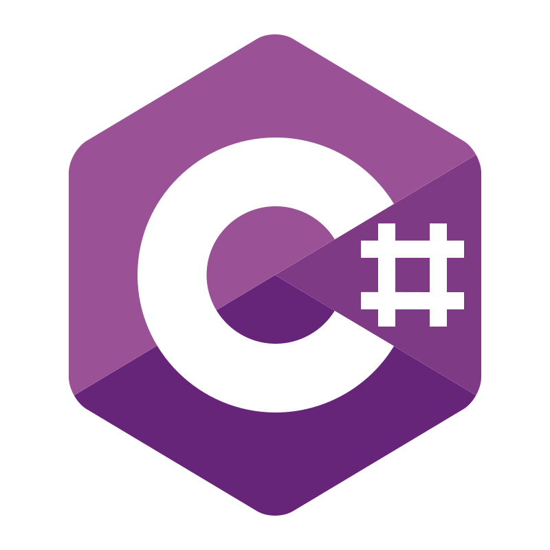

  <table>
    <tr>
      <td align="left">
         
        <b>Hi, I'm Jan!</b>  
        I'm currently in my final semester of Computer Science engineering studies at the Silesian University of Technology. I enjoy building robust backend architectures and desktop applications, and I am actively looking for an <b>IT Internship</b> or a <b>Junior Software Engineer</b> role to kickstart my career.
          
        Beyond standard development, I love exploring data processing, machine learning, and low-level hardware integration. When I'm away from the keyboard, you'll probably find me pointing my telescope at the night sky, capturing astrophotography, and developing my own image-stacking software.
          
      </td>
    </tr>
  </table>

 

  
   
  

 

  <table>
    <tr>
      <td align="left">
         
        <b>Tech Stack:</b>  
        &nbsp;&nbsp;
        &nbsp;&nbsp;
        &nbsp;&nbsp;
        
          
      </td>
    </tr>
  </table>

