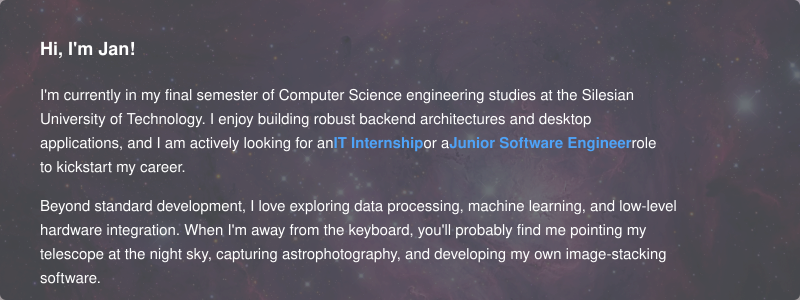
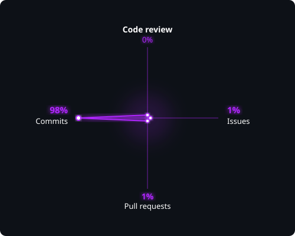
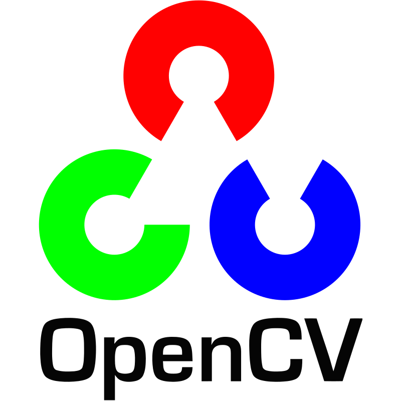
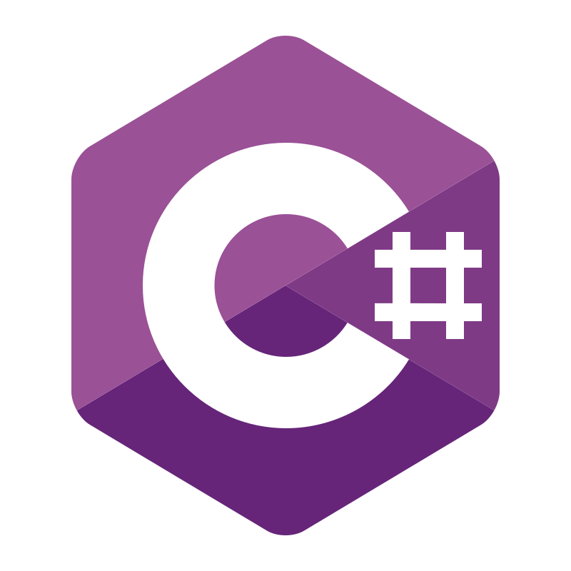
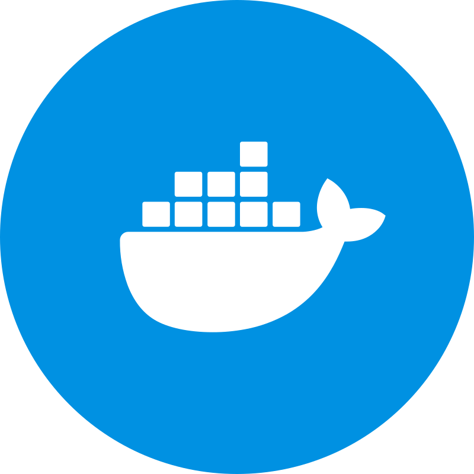
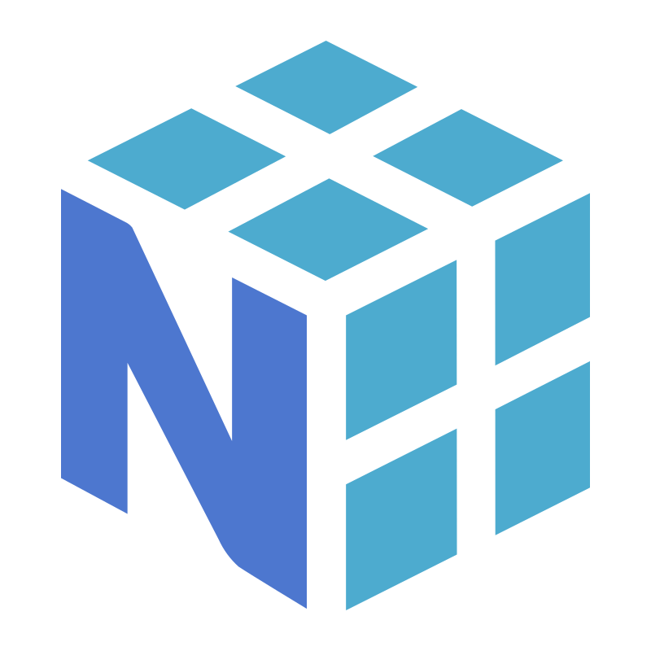
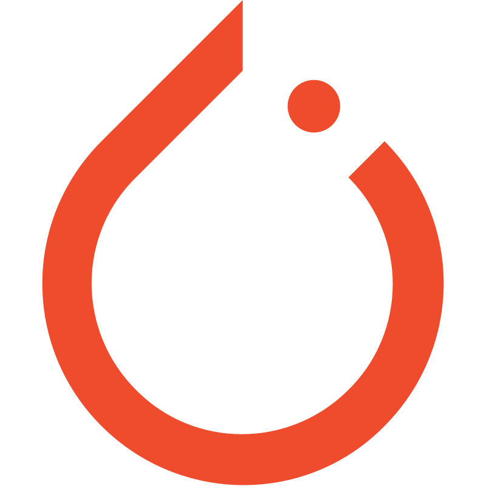
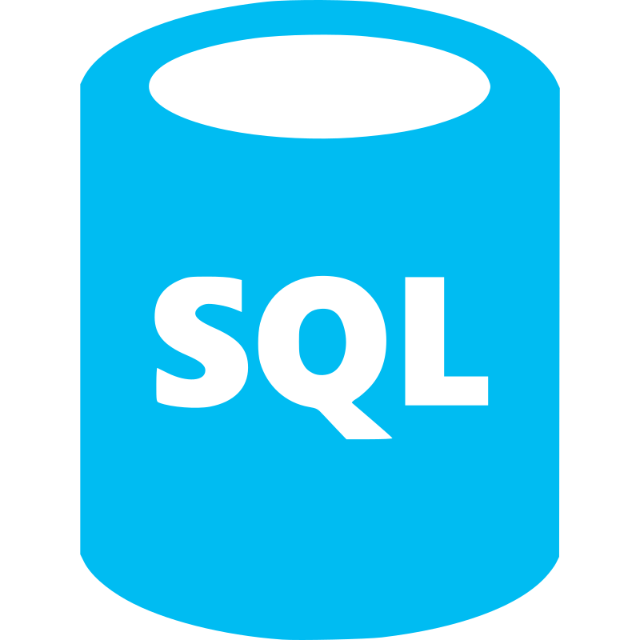
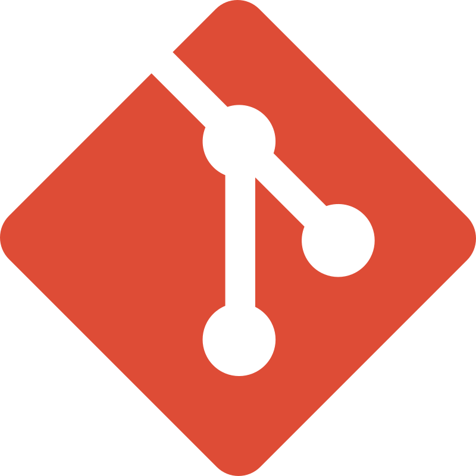

<table width="100%">
<tr>
<td align="left">
 
<b>Hi, I'm Jan!</b>  
I'm currently in my final semester of Computer Science engineering studies at the Silesian University of Technology. I enjoy building robust backend architectures and desktop applications, and I am actively looking for an <b>IT Internship</b> or a <b>Junior Software Engineer</b> role to kickstart my career.
  
Beyond standard development, I love exploring data processing, machine learning, and low-level hardware integration. When I'm away from the keyboard, you'll probably find me pointing my telescope at the night sky, capturing astrophotography, and developing my own image-stacking software.
  
</td>
</tr>
</table>

 

<!-- 

  

  -->

  
   
  

 
<!-- 

  

 -->

 
<h3 align="center">Tech Stack</h3>

  <table width="100%">
    <tr>
      <td align="center">
         
        &nbsp;&nbsp;
        &nbsp;&nbsp;
        &nbsp;&nbsp;
        &nbsp;&nbsp;
        &nbsp;&nbsp;
        &nbsp;&nbsp;
        &nbsp;&nbsp;
        &nbsp;&nbsp;
        &nbsp;&nbsp;
        &nbsp;&nbsp;
        &nbsp;&nbsp;
        &nbsp;&nbsp;
        &nbsp;&nbsp;
        &nbsp;&nbsp;
        &nbsp;&nbsp;
        &nbsp;&nbsp;
        &nbsp;&nbsp;
        &nbsp;&nbsp;
        
          
      </td>
    </tr>
  </table>

 

<h3 align="center">Featured Projects</h3>

<table width="100%" cellpadding="0" cellspacing="0">
<!-- Pierwszy projekt -->
<tr>
<td align="left" valign="middle" width="50%">
  <h3><a href="https://github.com/StanekJan02/StanekJan02">Profile README</a></h3>
  
My profile.

</td>
<td align="center" valign="middle" width="50%">
  
</td>
</tr>

<!-- Drugi projekt -->
<tr>
<td align="left" valign="middle" width="50%">
  <h3><a href="https://github.com/StanekJan02/Exoplanet-Detector">Exoplanet Detector</a></h3>
  
ML pipeline detecting exoplanets from Kepler data via signal processing, SMOTE, and 1D CNNs.

</td>
<td align="center" valign="middle" width="50%">
  
</td>
</tr>
</table>

</td>

</table>

